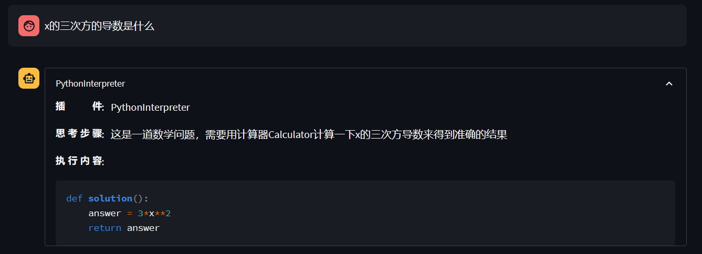

# 基础作业

## 使用InternLM-Chat-7B模型生成300字的小故事

## 熟悉hugging face下载功能

# 进阶作业

## 完成浦语·灵笔的图文理解及创作部署
### 图文创作

[输出结果](../Notes/Images/%E9%9D%92%E5%B2%9B%E5%B8%82%E6%97%85%E6%B8%B8%E6%94%BB%E7%95%A5/io.MD)

### 多模态对话

## 完成Lagent工具调用Demo创作部署

