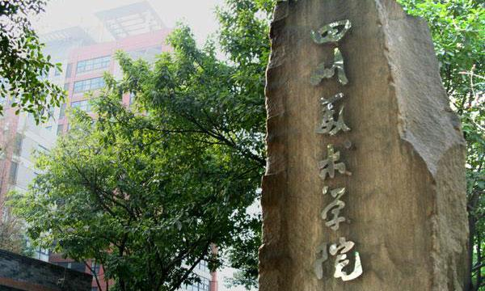
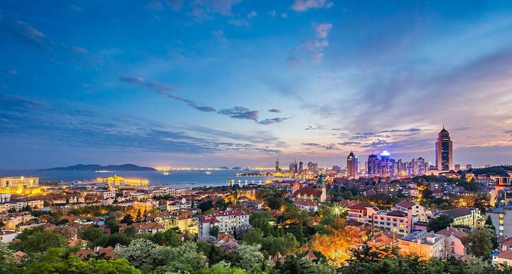

青岛，简称“青”，别称岛城、琴岛、胶澳，是山东省地级市，国务院批复确定的中国沿海重要中心城市、滨海度假旅游城市、国际性港口城市和国家历史文化名城。截至2021年，全市下辖8个区，代管3个县级市，总面积11293平方千米，建成区面积489.2平方千米，常住人口1034万人，城镇化率81.1%。

  

青岛市地处中国华东地区、山东半岛东南、东濒黄海，气候属温带季风气候，依山傍海，风景秀丽，四季常青，素有“东方瑞士”之美誉。境内海岸线长800多千米，有大小岛屿1700多个，其中崂山湾、栈桥湾、唐岛湾等16个海湾被辟为国家重点风景名胜区。2017年12月，当选中国工业百强城市。2018年11月，入选中国城市全面小康指数前100名。2018年12月，入选全国营商环境百强区。 2019年12月6日，位列全国农村一二三产业融合发展先导区创建办法评价A类县（市、区）名单榜首。  2020年5月，入选国家能源局综合司整县（市、区）屋顶分布式光伏开发试点名单。   2022年4月29日，经中央依法治国委入选为第一批全国法治政府建设示范地区和项目名单。

## **景点介绍**

  

### **五四广场**

五四广场位于青岛市市南区东海中路与莱阳路交汇处，因纪念1919年5月4日爆发的五四爱国运动而得名。该广场由德国设计师约翰·奥古斯特·冯·格罗皮乌斯设计，于1991年竣工并对外开放。整个广场呈不规则形状，南北长约400米，东西宽约200米，占地面积达60,000平方米，绿化面积30,000平方米，水面面积18,000平方米，绿地覆盖率达80%以上。其主体建筑——五月的风雕塑高28米，底部直径32米，用花岗岩砌成，象征着1919年5月4日爆发的一场彻底的反帝反封建的伟大爱国革命运动。此外，这里还建有大型音乐喷泉，每当夜幕降临，五彩斑斓的水柱腾空而起，场面壮观。

  

地址：青岛市市南区东海中路23号

门票：免费

开放时间：全天

交通：可乘坐地铁2号线到浮山所站下车，再步行即可到达。

  

### **鲁迅公园**

鲁迅公园位于青岛市市南区太平路2号，始建于清光绪三十三年（1907年），是一座集自然景观与人文景观于一体的综合性海滨公园。园内林木葱郁，绿草如茵，亭台楼阁错落有致，假山瀑布飞流直下，碧波荡漾，空气清新，景色宜人，是市民休闲娱乐的好去处。公园内的海底世界是中国最大的海洋水族馆之一，拥有近万尾各色热带观赏鱼以及各种珍稀的海底生物供游客参观。

  

地址：青岛市市南区太平路2号

门票：免费

  

开放时间：06:00-24:00

交通：可乘坐公交车至鲁迅公园站下车，再步行即可到达。

  

### **信号山公园**

信号山公园位于青岛市市北区登州路47号，建于1903年，曾是清朝北洋海军提督丁汝昌的官邸所在地。抗日战争时期，日军侵占青岛后，将其改为炮兵指挥所。解放战争时期，中国人民解放军攻入青岛时，曾在这里进行过激烈的战斗。如今，这座历经百年沧桑的老建筑已不复存在，取而代之的是现代化的高楼大厦。然而，它的历史

  
